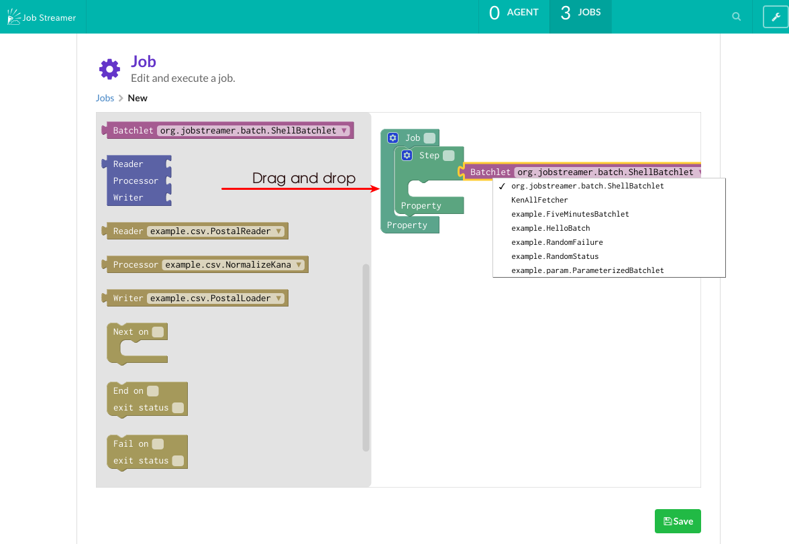

.. highlight:: guess

Create a job
===========

Create a job
--------------

1. Push the "new" button in job list view(top page).

.. image:: _images/new_job_button.png

2. Assemble job useing drag and drop like Scratch.

You can use Batchlet and ItemReader/ItemWriter/ItemProcessor only deployed on control bus.
When you wanna use new batch components,you must :doc:`deploy-batch-components`.